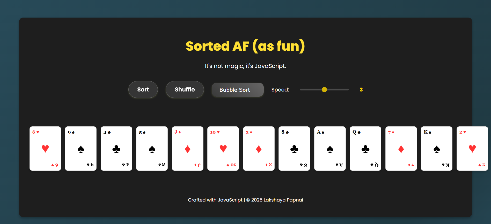

# Sorted AF

**Sorted AF (as fun)** is an interactive, animated sorting visualizer built with HTML, CSS, and JavaScript. This project demonstrates multiple sorting algorithms—such as Bubble Sort, Selection Sort, Insertion Sort, and Quick Sort—with smooth animations and sound effects. It's designed not only to illustrate the inner workings of these algorithms but also to showcase creative web development skills.

## Features

- **Multiple Sorting Algorithms:**  
  Implements Bubble, Selection, Insertion, and Quick sort algorithms with clear visual feedback.

- **Smooth Animations & Sound Effects:**  
  Enjoy dramatic card animations and audio cues (swap and placement sounds) that enhance the user experience.

- **Interactive Speed Control:**  
  An adjustable slider (values 1 to 5) lets you control the speed of the sorting process—making the visualization as quick or as detailed as you’d like.

- **Responsive Design:**  
  The visualizer adapts to different screen sizes, ensuring a great experience on various devices.

- **GitHub Pages Deployment:**  
  Easily deployable online, so you can share your live demo with potential employers or peers.

## Getting Started

### Prerequisites

- A modern web browser (Chrome, Firefox, Edge, or Safari)

### Running Locally

1. **Clone the Repository:**
   git clone https://github.com/lakshaya-papnai/Sorted-AF-Project.git
   cd Sorted-AF-Project
   
2. **Open the Project:**
Simply open the index.html file in your browser.
Then, navigate to http://localhost:8080 (or the port provided by your server).

### How It Works
Sorting Algorithms: Each algorithm is visually demonstrated by highlighting the cards that are compared and swapped. The project gives you an intuitive understanding of how sorting algorithms progress step by step.

Animations & Audio Feedback: Cards animate with a flip effect during swaps and change appearance to indicate progress. Background sounds (for shuffling, swapping, and final sorted state) emphasize each transition.

Speed Slider: The slider (with endpoints from 1 to 5) adjusts the delay between steps. This mapping lets you control the pace of the visualization—experiment with the settings to see different speeds in action.

### Deployment
This project is hosted on GitHub and can be deployed using GitHub Pages. After pushing your code:

1. Go to your repository on GitHub.

2. Navigate to Settings > Pages (or Settings > Code and automation > Pages).

3. Set the source to the main branch (and root folder, if applicable) and save.

4. Your live demo will be available at: https://lakshaya-papnai.github.io/Sorted-AF-Project/

### Future Enhancements:

Additional Sorting Algorithms: Add more algorithms (such as Merge Sort or Heap Sort) to the visualizer.

More UI Controls: Enhance interactivity by adding options for algorithm explanations, step-by-step debugging, or color themes.

Statistics Display: Integrate performance data like the number of comparisons or swaps.

### About
Developed by Lakshaya Papnai 

### License
This project is licensed under the MIT License.

   
